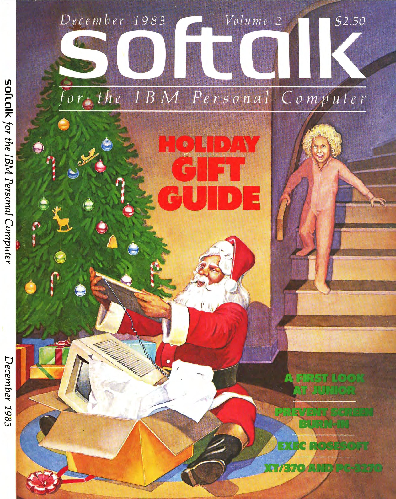
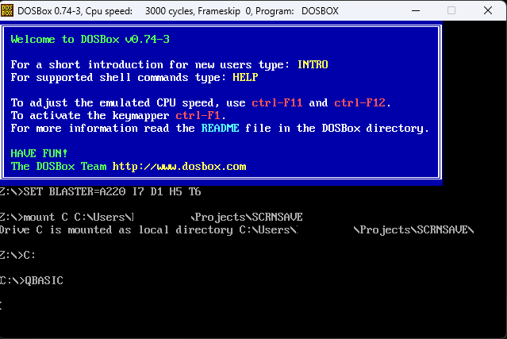
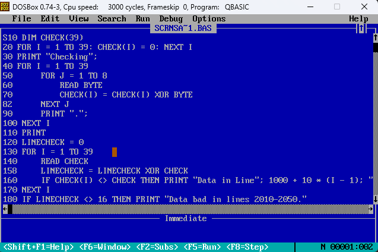
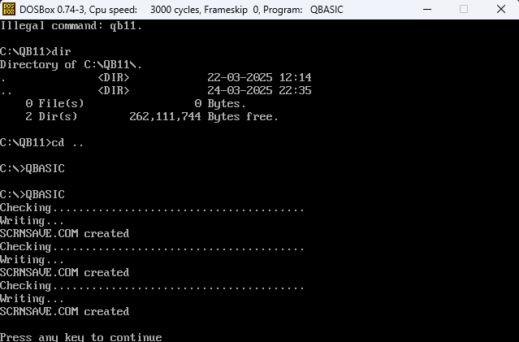

# ScrnSave - The first ever ScreenSaver 
This code was built by John Socha and published on Softalk for the IBM Personal Computer in December 1983 Volume 2 (for $2.50 at the time).


<div style="text-align: center;">
    
    <br>
    
    <br>
    
    <br>
    
</div>
- The programs were written in BASIC and were designed to run on an IBM PC (I assume somthing like a Model 5150) however, you can test them using dosbox or any other emulator that can run MS-DOS. However the effect of the screen saver will not be the same as the code hooks into the real hardware fo the clock, monitor, and keyboard (which is not emulated in dosbox).

## Files
- `SCRNSAVE_Simple.BAS` - A BASIC program that turns off the display by manipulating bit 2 of the I/O port, effectively blanking the screen on color/graphics adapters. Note: This does not hide the cursor on monochrome adapters due to a design flaw.

- `SCRNSAVE_Builder.BAS` - A BASIC program that generates a SCRNSAVE.COM file. Run the COM file to blank the screen by  manipulating bit 2 of the I/O port AND the cursor. This program provides a more complete solution for both color/graphics and monochrome adapters by ensuring the cursor is hidden during screen blanking.

- `SCRNSAVE_RestoreCusor.BAS` - A utility BASIC program that manually restores the cursor state if it remains visible after using SCRNSAVE.COM. Its useful for monochrome adapters where the cursor is not properly turned off by the .COM file.

## How to run from DOSBox
1. Download and install Basic 2 DOSBox which has QBasic 1.1, QuickBASIC 4.5, QuickBASIC Extended 7.1 and/or Visual Basic for DOS. - [Basic 2 DOSBox](https://www.qbasic.net/dl.php?id=SGmVWdlLWG3e2&file=qbdbox)
2. Once installed, run DOSBox. In Vscode powershell I used `& "C:\Program Files (x86)\DOSBox-0.74-3\DOSBox.exe"`
3. Inside Dosbox mount the directory where you have the files. For example, if you have the files in `C:\Users\YourName\Documents\ScrnSave`, you would run 
```bash
mount C C:\Users\YourName\Documents\ScrnSave  # Hit enter to create the mounted drive 
C: # Hit enter to change to the mounted drive 
```
4. Run QBASIC 11 `QBASIC`. You may have to move to the directory where qb11 exists or move qb11 to the directory where you have the files.


5. Once in QBASIC, load the file you want to run. For example, if you want to run `SCRNSAVE_Builder.BAS`, you would type `LOAD "SCRNSAVE_Builder.BAS"` and hit enter.

6. Once the file is loaded, you can run it by typing `RUN` and hitting enter. Or press F5 to run the program.


## Helpful Links
- [John Socha - Nieuwe Instituut](https://nieuweinstituut.nl/en/projects/sleep-mode/john-socha)  
- [John Socha - Wikipedia](https://en.wikipedia.org/wiki/John_Socha)  
- [The Ever-Changing Art of the Screensaver](https://eyeondesign.aiga.org/the-ever-changing-art-of-the-screensaver/)  
- [John Socha-Leialoha - LinkedIn](https://www.linkedin.com/in/john-socha-leialoha-963150/)

## Easter Eggs
- [SCRNSAVE.EXE - Microsoft Learn](https://learn.microsoft.com/en-us/windows/win32/devnotes/scrnsave-exe)